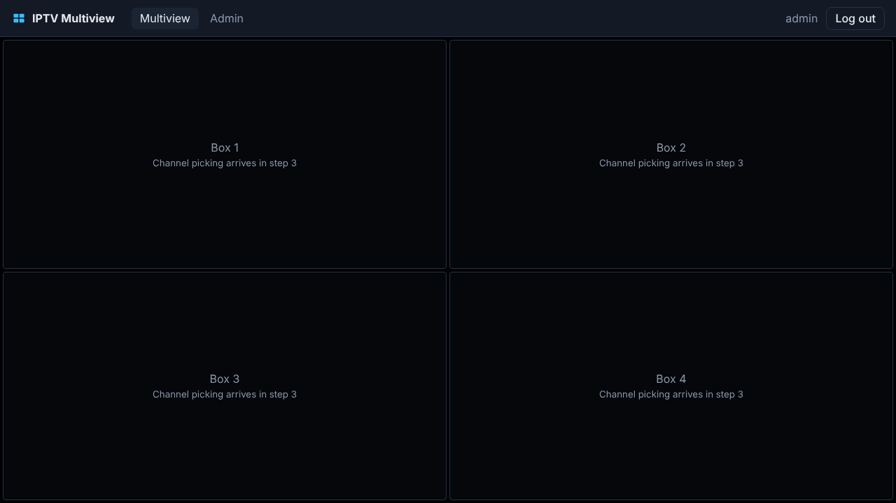
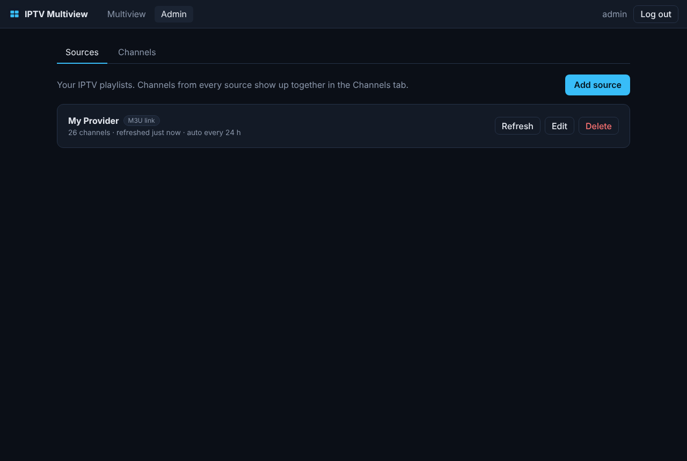
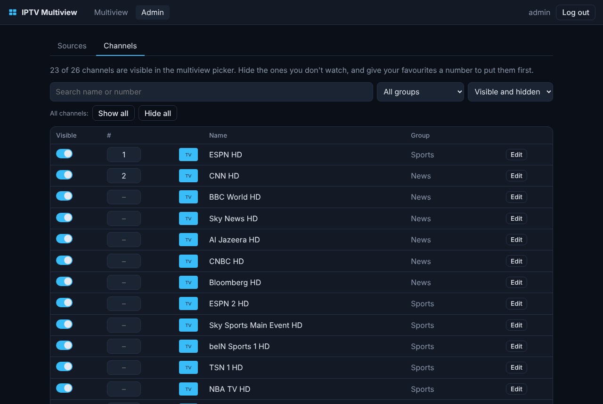

# IPTV Multiview

A self-hosted IPTV manager with a 4-box multiview. Add your IPTV playlists in the admin side, then watch four channels at once and click any box to choose what it plays.

Runs as a single Docker container, built for Unraid.



| Admin: sources | Admin: channels |
| --- | --- |
|  |  |

## Roadmap

1. **Foundation**: app shell, login, SQLite storage, Docker/Unraid packaging ✅
2. **Admin**: add M3U / Xtream sources, import and manage channels ✅
3. **Multiview**: 2x2 HLS player, click a box to pick its channel, per-box audio toggle, fullscreen ✅
4. **Polish**: EPG / now playing, favorites, more layouts

## Install on Unraid

### Option A: Docker Compose (Compose Manager plugin)

Use [`docker-compose.yml`](docker-compose.yml). Data is stored in `/mnt/user/appdata/iptv-multiview`.

### Option B: Unraid template

Copy [`docker/unraid-template.xml`](docker/unraid-template.xml) to `/boot/config/plugins/dockerMan/templates-user/my-iptv-multiview.xml`, then in the Docker tab choose **Add Container** and pick `iptv-multiview` from the template list.

Open `http://<server-ip>:9292` and create your admin account on first visit.

The image is published to `ghcr.io/stefanhoagland/iptv-plus-4box-mv:latest` on every push to `main` (amd64). If the repository is private, either make the package public under GitHub → Packages, or build locally with `docker compose build`.

## Adding channels

In **Admin → Sources**, add one or more sources:

- **M3U link**: the playlist URL from your provider (often `get.php?…&type=m3u_plus`).
- **Upload M3U**: a playlist file from your computer.
- **Xtream login**: server URL, username and password. Streams are played as HLS (`.m3u8`).

Linked sources refresh automatically (every 24 hours by default; change it under *Advanced*). Some providers only answer known players, so the default user agent is VLC's; you can change that under *Advanced* too.

In **Admin → Channels**, hide what you don't watch (one at a time, or a whole group with *Hide all*), give favourites a number to put them first, and rename or re-logo channels. Your edits are kept when a source refreshes. Only visible channels will appear in the multiview picker.

## Watching

On the **Multiview** page, click any box to choose its channel (search, or filter by group). Hover a box for its controls:

- 🔊 **Audio** on/off for that box. Boxes start muted; any number can be on at once. Keys **1–4** toggle each box's audio too.
- ⛶ **Fullscreen** for that box.
- ✕ **Clear** the box.

Your four boxes and their audio settings are remembered. All playback goes through the server (`/api/play/…`), so provider credentials never reach the browser and streams work even without CORS headers. HLS (`.m3u8`) plays everywhere; raw MPEG-TS streams play in Chrome, Edge and Firefox.

Some channels use formats browsers can't decode, typically Dolby (AC-3/E-AC-3) audio or MPEG-2/HEVC video, which shows up as a black box. The player detects this (codec errors, sound but no picture, or nothing starting) and switches that box to a **converted** stream: the server runs it through ffmpeg, copying H.264 video when it can and re-encoding otherwise, with stereo AAC audio. Converted boxes show a small *Converted* label, and the app remembers which channels need it. Re-encoding video uses CPU on the server (roughly one core per channel at 720p).

## Live NFL preset

On the Multiview page, **🏈 Live NFL** lists today's games (from ESPN's public schedule) with the channel each one is on in *your* list:

1. A channel named after the matchup, e.g. `NFL 01: Chicago Bears vs Green Bay Packers` or `NFL 02 | KC @ BUF`.
2. Otherwise the network carrying it (CBS, FOX, NBC, ABC, ESPN, NFL Network, Prime Video, Peacock, Netflix), skipping sister channels such as FOX News or CBS Sports Network.

**Put live games in the boxes** fills boxes 1–4 (game channels before network channels); the 1–4 buttons on each game put it in a specific box. Providers rename event channels on game day, so playlists older than 3 hours are refreshed before matching. Hidden channels are matched too.

## Configuration

| Variable | Default | Purpose |
| --- | --- | --- |
| `PORT` | `9292` | Web UI port |
| `DATA_DIR` | `/config` | Where the SQLite database lives |
| `ADMIN_USERNAME` / `ADMIN_PASSWORD` | (unset) | Optional: create or reset the admin login on startup (handy if you forget the password) |
| `SECURE_COOKIES` | `false` | Set `true` when served over HTTPS behind a reverse proxy |
| `LOG_LEVEL` | `info` | `debug`, `info`, `warn`, `error` |

The container runs as `99:100` (Unraid's `nobody:users`), so the appdata folder must be writable by that user, which it is by default on Unraid.

## Development

Requires Node 22.13+.

```sh
npm install
npm run dev -w server   # API on :9292, data in ./data
npm run dev -w web      # UI on :5173, proxies /api to :9292
npm test
npm run typecheck
```

Stack: Fastify + Node's built-in SQLite on the server, React + Vite on the web side.
