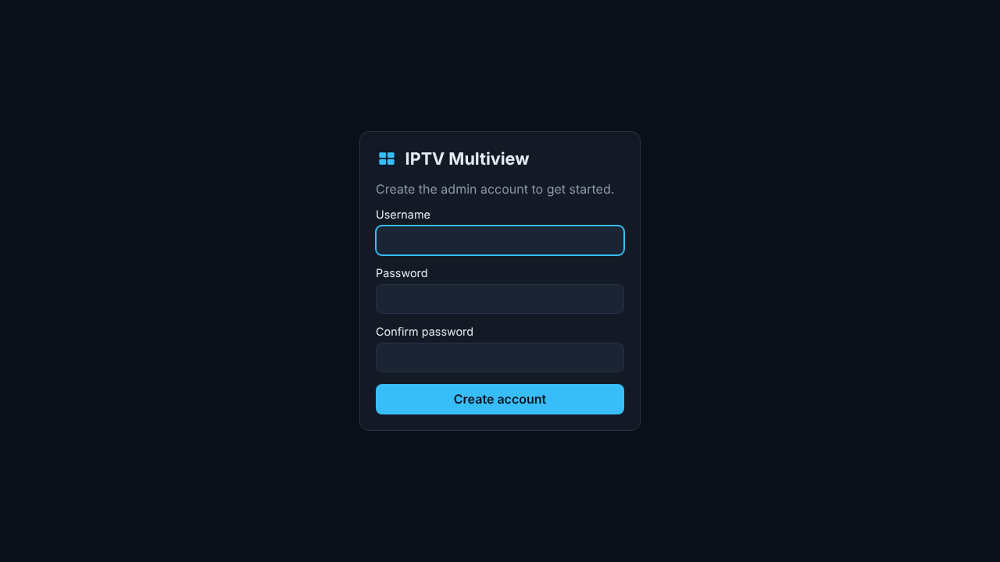

# IPTV Multiview

A self-hosted IPTV manager with a 4-box multiview. Add your IPTV playlists in the admin side, then watch four channels at once and click any box to choose what it plays.

Runs as a single Docker container, built for Unraid.

| First run | Multiview |
| --- | --- |
|  |  |

## Roadmap

1. **Foundation**: app shell, login, SQLite storage, Docker/Unraid packaging ✅
2. **Admin**: add M3U / Xtream sources, import and manage channels
3. **Multiview**: 2x2 HLS player, click a box to pick its channel, per-box audio toggle, fullscreen
4. **Polish**: EPG / now playing, favorites, more layouts

## Install on Unraid

### Option A: Docker Compose (Compose Manager plugin)

Use [`docker-compose.yml`](docker-compose.yml). Data is stored in `/mnt/user/appdata/iptv-multiview`.

### Option B: Unraid template

Copy [`docker/unraid-template.xml`](docker/unraid-template.xml) to `/boot/config/plugins/dockerMan/templates-user/my-iptv-multiview.xml`, then in the Docker tab choose **Add Container** and pick `iptv-multiview` from the template list.

Open `http://<server-ip>:9292` and create your admin account on first visit.

The image is published to `ghcr.io/stefanhoagland/iptv-plus-4box-mv:latest` on every push to `main` (amd64). If the repository is private, either make the package public under GitHub → Packages, or build locally with `docker compose build`.

## Configuration

| Variable | Default | Purpose |
| --- | --- | --- |
| `PORT` | `9292` | Web UI port |
| `DATA_DIR` | `/config` | Where the SQLite database lives |
| `ADMIN_USERNAME` / `ADMIN_PASSWORD` | (unset) | Optional: create or reset the admin login on startup (handy if you forget the password) |
| `SECURE_COOKIES` | `false` | Set `true` when served over HTTPS behind a reverse proxy |
| `LOG_LEVEL` | `info` | `debug`, `info`, `warn`, `error` |

The container runs as `99:100` (Unraid's `nobody:users`), so the appdata folder must be writable by that user, which it is by default on Unraid.

## Development

Requires Node 22.13+.

```sh
npm install
npm run dev -w server   # API on :9292, data in ./data
npm run dev -w web      # UI on :5173, proxies /api to :9292
npm test
npm run typecheck
```

Stack: Fastify + Node's built-in SQLite on the server, React + Vite on the web side.
